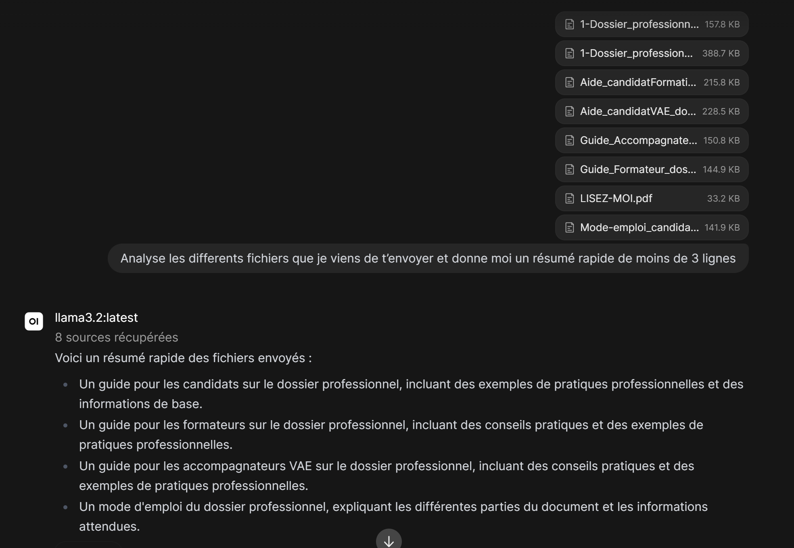

# Projet LLM

## Questionnaire 
 1) Expliciter la procédure pas à pas pour installer un WebGUI sur votre LLM local
    - Nous installons docker sur le serveur afin d'isoler le service WebGui de la machien hôte, puis installer WebGui dessus. Enfin, il faut permettre a WebGui et Ollama de communiquer ensemble, notamment en ouvrant un port sur WebGui en l'occurence le port 11434 (http://host.docker.internal:11434).

2) Peut on modifier le contexte d'un LLM local et si oui comment?
    - oui, le contexte d’un LLM local peut être modifié, principalement en contrôlant les messages et les informations envoyés au modèle via son API ou son interface.

    - Avec un LLM local utilisant Ollama, on peut modifier le contexte de plusieurs façons:
          - en modifiant le prompt système pour définir le comportement et les instructions du modèle ;
          - en ajoutant, supprimant ou modifiant l’historique de conversation ;
          - en injectant dynamiquement des informations supplémentaires dans le prompt ;
          - en utilisant un système de RAG pour récupérer des informations pertinentes depuis une base de données ou des documents.
          - Ces modifications ne changent pas les paramètres internes du modèle : elles changent simplement les informations que le modèle reçoit au moment de répondre

3) Comment faire ingérer à votre LLM local le contenu d'un dossier avec quelques PDF?
   - Il est possible de fournir un dossier avec plusieurs fichiers à une IA, en l'occurence ici nous lui avons fournis plusieurs PDF, qu'il a su lire et résumé en quelques lignes 

4) Comment modifier le comportement général de notre LLM Local à l'aide d'un fichier ?
    - Oui il est possible de créer un "Modelfile", qui se résume à une sorte de fichier de configuration, dans lequel nous allons mettre des paramètres précis pour nos réponses souhaitées par l'IA. Ensuite, nous allons indiquer au modèle de s'appuyer sur ce fichier de "configuration" pour les réponses futures

5) Prouver que votre LLM local à pu ingérer correctement les données de fichiers PDF
    - Notre LLM locale n'a pas accès à la recherche web, il tire ses réponses de ses connaissances web qui datent de fin 2023. Si l'on veux des réponses plus récentes, il faut activer la recherche web dans les paramètres WebGui par exemple, en indiquant une clé API d'un des moteurs de recherche. A noter que cela sera payant dans la plupart des cas.
6) Comment forcer votre LLM local à aller chercher ce qu'il ne sait pas sur Internet, est-ce possible? et si oui comment?
7) 
